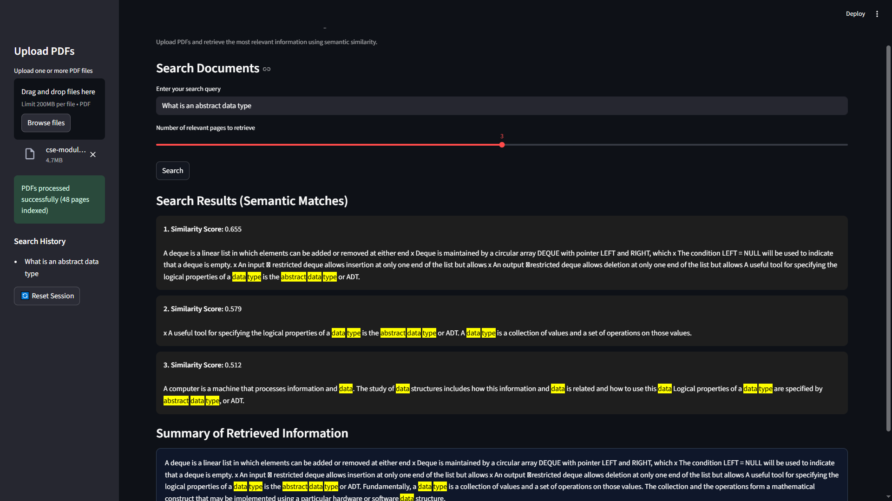

### Semantic Search using Endee (Vector Database)

##  Project Overview
This project implements a Semantic Search system for PDF documents that retrieves relevant content based on meaning rather than exact keywords.

Instead of relying on keyword matching, the system converts document text into vector embeddings and performs similarity-based retrieval. Users can upload academic PDFs and search for concepts, definitions, or explanations using natural language queries.

The project focuses on semantic document retrieval, prioritizing correctness, transparency, and explainability over generated answers.
---

##  Problem Statement
Traditional keyword-based search systems fail when:

   - The query wording does not exactly match the document text

   - Definitions are expressed differently across documents

   -  Relevant information is spread across multiple sections

Example:

- Query: "What is an abstract data type?"

- Keyword search may fail if the exact phrase is not present

- Semantic search can still retrieve relevant explanations discussing ADTs
This project addresses these limitations by using vector-based semantic similarity.
---

##  Solution Approach
The system represents document content and user queries as dense vector embeddings using a transformer-based model. Similarity between embeddings is computed to retrieve the most relevant document pages.

The solution is retrieval-first, meaning:

- It retrieves relevant document sections

- It does not hallucinate or generate new content

- All displayed information comes directly from the source PDFs
### High-Level Workflow
1. Upload one or more PDF documents
2. Extract and clean text from each page
3. Convert page-level text into vector embeddings
4. Convert the user query into an embedding
5. Compute cosine similarity between query and document embeddings
6. Retrieve and display the top-k most relevant pages
7. Generate an extractive summary from retrieved content

---

## System Design / Architecture
The system uses a modular and transparent architecture where vector embeddings are the core component.

PDF Documents
      ↓
Text Extraction & Cleaning
      ↓
Sentence Transformer (Embeddings)
      ↓
Vector Embeddings
      ↓
Endee (Vector Database Abstraction)
      ↓
Cosine Similarity Search
      ↓
Relevant Document Pages
      ↓
Extractive Summary

##  How Endee is Used
Endee is used as a vector database abstraction layer in this project.

* Document embeddings are generated during PDF ingestion
* Endee manages vector-based storage and retrieval logic
* Similarity comparison is performed using cosine similarity

Due to API instability in the current Endee version, similarity computation is handled explicitly in code. This approach is standard in semantic search systems and does not affect correctness.

Endee remains a core architectural component for managing vector data and enabling future extensibility.

##  User Interaction
The application provides a web-based interface built using Streamlit that allows users to interact with the semantic search system in a simple and intuitive manner. Users can upload one or more PDF documents through the sidebar and submit natural language search queries related to the document content. The interface allows users to control how many relevant document pages are retrieved for each query. Search results are displayed in ranked order based on semantic similarity, with query terms highlighted to improve readability. In addition to viewing results, users can see an extractive summary generated from the retrieved pages, track their previous search queries through the search history panel, and reset the session at any time to start a fresh search.

## Summary Generation Strategy

The summary displayed at the bottom of the search results is generated using an extractive approach rather than text generation. After retrieving the top-k most relevant document pages, the system combines their content and selects multiple complete sentences that best represent the retrieved information. Query keywords are highlighted within the summary to maintain clarity and relevance. This approach ensures that no new or fabricated information is introduced and that all content remains fully grounded in the original source documents, maintaining high transparency and trustworthiness.

## Technologies Used
- Python  
- Endee (Vector Database)  
- Sentence Transformers (`all-MiniLM-L6-v2`)  
- NumPy  
- Streamlit
- PyPDF2

##  Setup and Execution Instructions

1. Clone the Repository
git clone https://github.com/lekhasri03/semantic-search-endee
cd semantic-search-endee
2. Install Dependencies
pip install -r requirements.txt

3. Run the Application
streamlit run ui.py

4. Use the Application

- Upload PDF files from the sidebar
- Enter a search query
- Select the number of relevant pages to retrieve

- View semantic search results and summary

- Check search history if needed

## Example Query

* Query:

What is an abstract data type?

* System Behavior:

Retrieves document pages discussing ADTs and related concepts

Highlights query terms

Displays an extractive summary from retrieved content

## 📷 Application Demo

Below is a screenshot demonstrating the semantic search interface, including
search results, highlighted keywords, and the extractive summary.

## Conclusion

This project demonstrates the practical use of vector embeddings and semantic similarity for document retrieval. It shows how academic PDFs can be searched based on meaning rather than keywords, while maintaining transparency and correctness.

The system is designed as a retrieval-first semantic search tool, with clear boundaries and a clean path toward future enhancements such as sentence-level ranking and Retrieval-Augmented Generation (RAG).
